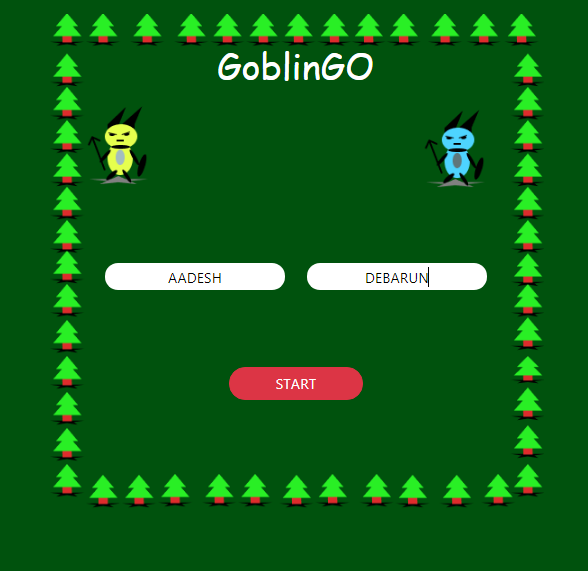
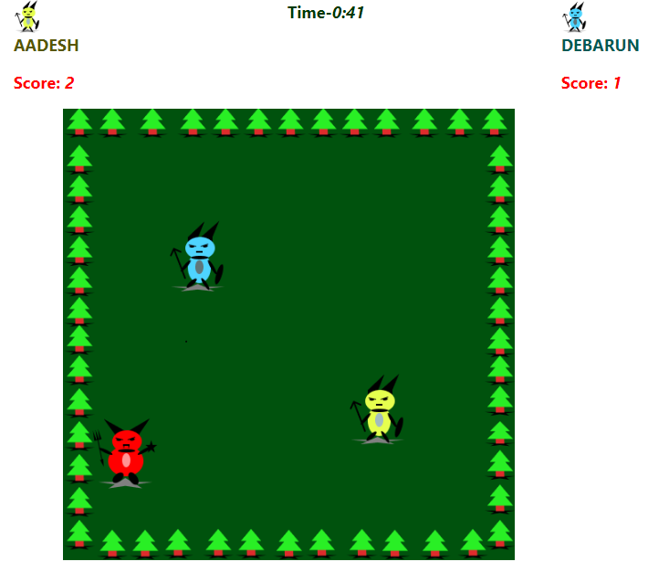
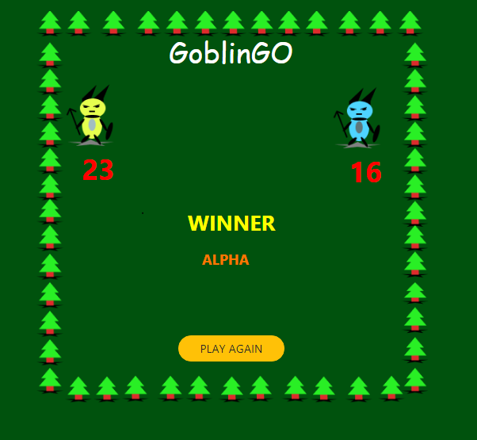

# CanvasGame

Simple canvas game using HTML,CSS,javaScript,jquery,Bootstrap.

## Application Name
GoblinGo

## Author:

[Aadesh Nichite](https://github.com/AadeshNichite)

[Debarun Mitra](https://github.com/DebarunMitra)

## Technology Used:

HTML,Canvas, CSS, JavaScript(ES6), Bootstrap

## Objective:

Create a GoblinGo game

## Game Rules:

#### 1) First set a player name.
#### 2) Click on to the start button and play.
#### 3) Timer runs for one minute.
#### 4) Player who score more will win.

## Image:

#### ++++++++++++++++++++++++++++++++++++++++++++++++++++++++++++++++++++++

#### ++++++++++++++++++++++++++++++++++++++++++++++++++++++++++++++++++++++

## Visit:
[GoblinGO](https://aadeshnichite.github.io/CanvasGame/)
